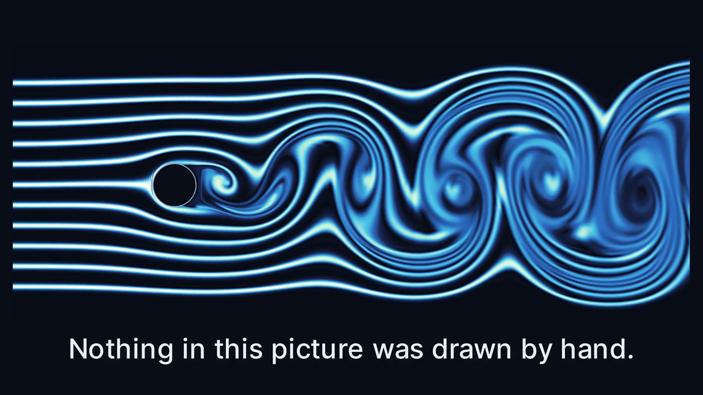
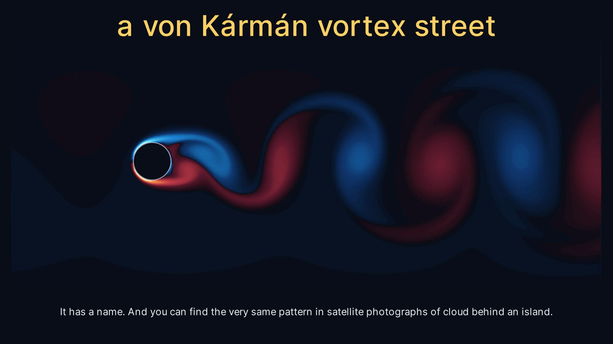
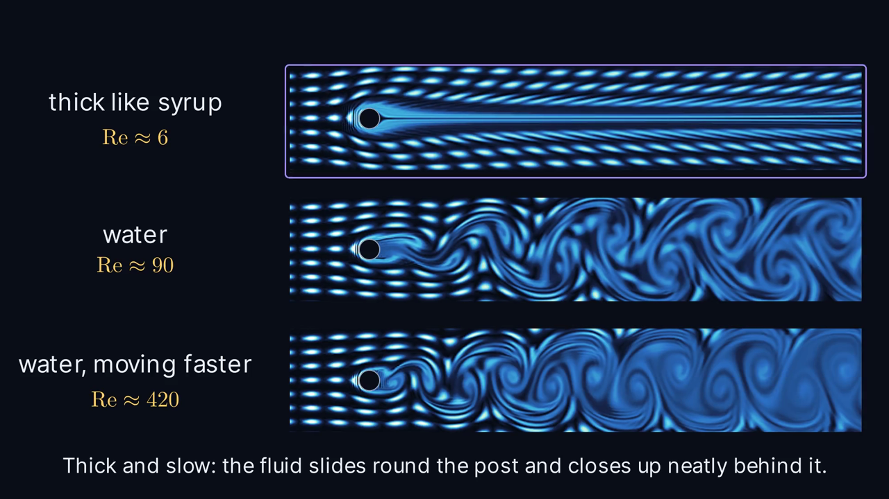
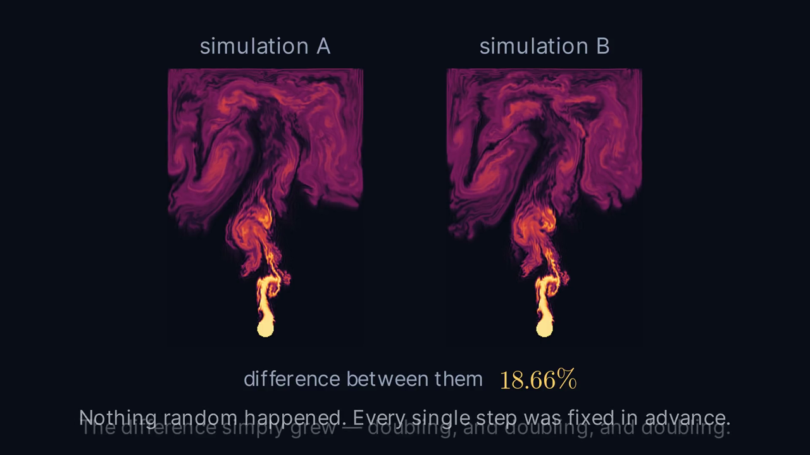
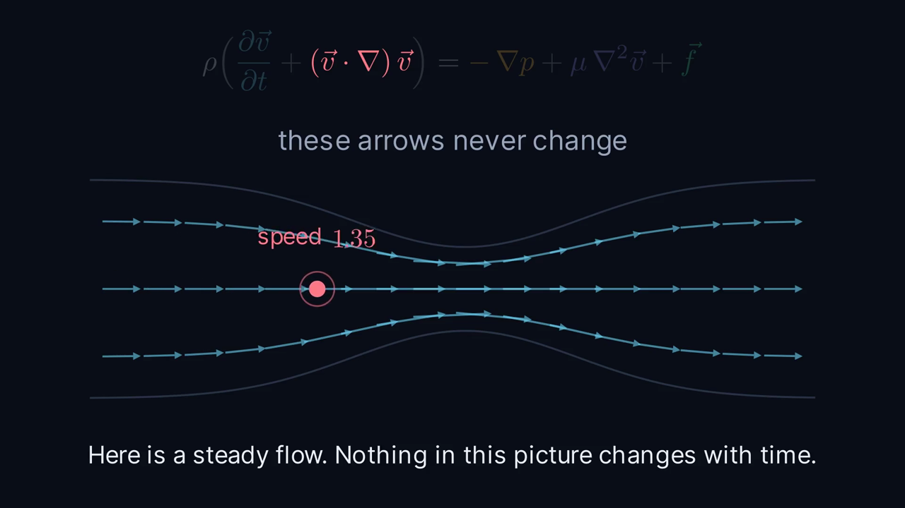

# Navier–Stokes, explained from zero

A ~9-minute Manim Community film that explains the Navier–Stokes equations to
someone with no background, and backs the explanation with a **real** fluid
solver rather than hand-drawn animation. Every swirl on screen is the output of
an incompressible Navier–Stokes solve.



*Flow past a cylinder, traced by dye. Not drawn by hand — this is the output of
the solver in `fluid.py`.*

| | |
|---|---|
|  |  |
| The same flow coloured by vorticity | One number, three different worlds |
|  |  |
| Two runs forked by one part in 10,000 | Why the nonlinear term is the hard one |

**Builds to** `out/navier_stokes_1080p60.mp4` — 8m 50s, 1920×1080 @ 60 fps, h264,
49 MB. All 11 scenes render and have been checked frame by frame.

## Getting started

The repository carries source only. The baked simulation frames (~1 GB) and the
rendered film are both build products and are not in git.

```bash
python3 -m venv .venv                       # or: uv venv .venv
.venv/bin/pip install -r requirements.txt
.venv/bin/python bake.py all                # ~90 min, writes cache/
.venv/bin/python build.py -q h -j 4         # ~10 min, writes out/
```

A LaTeX installation is required — Manim shells out to it for every equation.
On macOS, MacTeX or BasicTeX with `standalone`, `amsmath` and `ragged2e`.

## Build

```bash
.venv/bin/python build.py                 # preview pass, 480p15, concatenated
.venv/bin/python build.py -q h -j 4 -f    # final 1080p60 -> out/navier_stokes_1080p60.mp4
.venv/bin/python build.py -q l -s S07Solve   # a single scene, no concat
./sheet.sh media/videos/scenes_sim/480p15/S07Solve.mp4 /tmp/s07.png 4 4
```

`sheet.sh` tiles evenly-spaced frames into one image — the fastest way to check
a scene without watching it end to end.

The three simulation bakes are already cached in `cache/` (~1.3 GB). They only
need re-running if the solver or the bake parameters change:

```bash
.venv/bin/python bake.py street      # ~25 min   the hero vortex street
.venv/bin/python bake.py reynolds    # ~25 min   three viscosities, same clock
.venv/bin/python bake.py plume       # ~40 min   two plumes forked by 1e-4
```

## Running order

| # | scene | length | cache |
|---|---|---|---|
| 1 | `S01Title` | 19s | street |
| 2 | `S02Field` — molecules to a velocity field | 48s | — |
| 3 | `S03Newton` — it is F = ma in disguise | 39s | — |
| 4 | `S04Acceleration` — ∂v/∂t and the nonlinear term | 60s | — |
| 5 | `S05Forces` — pressure, viscosity, body forces, ∇·v = 0 | 55s | — |
| 6 | `S06Assemble` — the whole equation in plain English | 24s | — |
| 7 | `S07Solve` — no formula, so: arithmetic | 87s | street |
| 8 | `S08Reynolds` — one number changes everything | 51s | reynolds |
| 9 | `S09Chaos` — two futures | 57s | plume |
| 10 | `S10Prize` — the cascade and the open question | 62s | — |
| 11 | `S11Outro` | 35s | street |

## Why there is a separate venv

The system Anaconda has scipy 1.13 compiled against numpy 1.x with numpy 2.2
installed, so `import manim` dies with an ABI error. `.venv/` is an isolated
uv environment; the base conda install was left untouched.

## Layout

| file | what it is |
|---|---|
| `fluid.py` | the solver: staggered MAC grid, SSP-RK3 convection + diffusion, sparse-LU pressure projection, MacCormack scalar transport |
| `bake.py` | runs the three simulations, caches frames as uint8 `.npy` + a JSON sidecar |
| `theme.py` | palette, type scale, and the colour maps (built in linear light) |
| `common.py` | `FieldMovie` (plays a cached field as an `ImageMobject`), `Caption`, the shared equation |
| `scenes_intro.py` | S01–S03 |
| `scenes_terms.py` | S04–S06 |
| `scenes_sim.py` | S07–S08 |
| `scenes_open.py` | S09–S11 |
| `build.py` | parallel render + concat |

## The solver

Genuinely solves incompressible Navier–Stokes in 2D:

- **Staggered grid** so the discrete divergence and gradient are exact adjoints.
- **SSP-RK3** on convection + diffusion. Centred (non-dissipative) convection
  keeps vortices crisp; RK3's stability region covers enough of the imaginary
  axis to make that stable.
- **Projection** via a sparse LU of the pressure Poisson operator, factorised
  once and reused. Neumann at solid walls / inflow / free-slip walls, Dirichlet
  at the outflow. Post-projection divergence sits at solver-residual level
  (~1e-5 relative in the channel, ~1e-14 in the closed box).
- **MacCormack + limiter** for dye transport. Plain semi-Lagrangian smears dye
  into mush after a few hundred steps; this keeps streaklines sharp enough to
  show the spiral roll-up. It is the single biggest visual win in the project.

**Sanity check:** the street bake measures its own shedding period and reports
a Strouhal number of **0.222** (`cache/street.json`), against the textbook ~0.2
for a circular cylinder. If the solver is ever touched, that number is the
first thing to re-check.

## Things worth knowing before editing

- **The plume is only weakly chaotic** — separation doubles roughly every 100
  time units. That is why S09 forks at ε = 1e-4 rather than something more
  dramatic, and why the capture window sits where it does: it has to begin
  while the two runs are visually identical and end after they have clearly
  parted. The narration beats in S09 are placed against the *measured*
  separation curve stored in `cache/plume.json`. Change `NU`, `BUOY` or `DT`
  and all of that has to be re-measured.
- **Everything shown is two-dimensional.** S10 says so explicitly, because
  global regularity in 2D is a theorem — the Millennium Prize problem is the 3D
  case. Do not let an edit blur that.
- **Vorticity tone mapping is `gamma=0.72`.** At the 0.55 originally used, the
  faint channel-scale shear was lifted into a red/blue wash that muddied the
  whole frame; a hard floor instead erased the downstream vortices. 0.72 is the
  balance. The cached `street__vort.npy` was remapped in place to match.
- **`FieldMovie` interpolates between cached frames.** Playback is usually
  slower than capture (S09 plays 660 frames over 46 s), and without blending
  the motion visibly steps. It also defaults to `loop=False` per scene now —
  an earlier version looped mid-scene and reset S09's on-screen counter.
- **Vorticity sign convention.** ω = ∂v/∂x − ∂u/∂y, so *positive is
  anticlockwise*, and `signed_to_u8` sends positive to the **warm** half of the
  map. The S07 legend originally had this backwards. It now samples
  `VORTICITY_LUT` at ±0.45 rather than hard-coding colours, so the swatches
  match what is actually on screen and survive a change of tone map. Verified
  against a known anticlockwise solid-body rotation (`u = -y`, `v = +x` → ω = +2).
- Scene pacing is driven by `Caption.say(..., hold=)`.

## Known rough edges

- `build.py` concatenates with `-c copy`; if Manim ever emits mismatched
  stream parameters this needs a re-encode instead.
- The Reynolds panels crop to `(52, 612, 24, 126)`; if the grid in
  `bake_reynolds` changes, that crop must change with it.
- `test_solver.py` / `test_street.py` are scratch benchmarks from bring-up, not
  a test suite.
